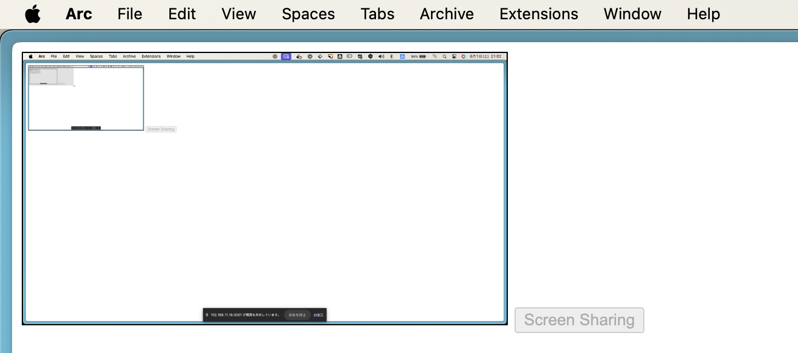
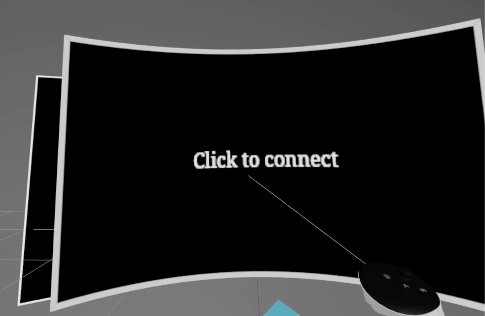

# 🥽 three-fiber-webxr-toolbox


This toolset provides useful components for creating xr content with react-three-fiber.

## Motivation

When developing WebXR, I strongly wanted to develop in immersive mode while wearing VR goggles. If I could do that, I would be able to change the color and shape of objects in the real world just by rewriting my own code. I feel like a god.

## Getting Start

```
npm install three-fiber-webxr-toolbox
```

## Components

The three-fiber-webxr-toolbox component enables development like the following video.

↓ Click to play video
<br/>
[](https://www.youtube.com/watch?v=jAYIertq6jA)

### XRErrorBoundary

This component is used to prevent webgl context from being lost if there is an error in the code. If an error occurs, an error window is displayed in XR space.

Be sure to install directly under the XR component. The context is lost when XRErrorBoundary itself is re-rendered.

```tsx
import { XrErrorBoundary } from 'three-fiber-webxr-toolbox'

ReactDOM.createRoot(document.getElementById("root") as HTMLElement).render(
  <React.StrictMode>
    <ARButton />
    <Canvas>
      <XR>
        <XrErrorBoundary>
          <App />
        </XrErrorBoundary>
      </XR>
    </Canvas>
  </React.StrictMode>
);
```

### ConsoleProvider

Console logs cannot be viewed when wearing a head-mounted display. This component is designed to be used as an alternative in such cases.

If it is a child element of ConsoleProvider, it can push console messages from useConsole hooks.

```tsx
import { XrErrorBoundary } from 'three-fiber-webxr-toolbox'

const App = () => {
  return (
    <ConsoleProvider>
      <Child />
    </ConsoleProvider>
  )
}

const Child = () => {
  const { pushMessage } = useConsole()

  useEffect(() => { pushMessage('Hello World!') })

  return (
    <mesh>
      ...
    </mesh>
  )
}
```

### Portal

When developing in XR's immersive mode, it is sometimes inconvenient to see the keyboard, mouse, or coffee mug. In such cases, this component creates a hole to partially view the pass-through image.

[](https://www.youtube.com/watch?v=rM7_0A17NJ4)

```tsx
<Portal position={[0, 0.6, -0.5]} />
```

**attention**
Even when VR content is created, it must be made in AR or the pass-through image will not be projected.

### RemoteDisplay

This component is used to display a PC display within the content being developed. This component allows for more seamless development in immersive mode.

[](https://www.youtube.com/watch?v=c8S02jZ2Hs0)

English: Currently, you need to use a Vite plugin. We are preparing tools for use outside of Vite, so please wait a little longer.

1. Add remoteDisplayServer plugin to vite.config.ts

```TypeScript
import { remoteDisplayServer } from 'three-fiber-webxr-toolbox'

export default defineConfig(({ command }) => {
  if (command === 'serve') {
    return {
      root: 'examples',
      plugins: [
        remoteDisplayServer(),
      ],
    }
  }
  ...
}
```

1. Access /remote_display for screen sharing.



1. Pass local IP to RemoteDisplay.

```tsx
import { RemoteDisplay } from 'three-fiber-webxr-toolbox'

ReactDOM.createRoot(document.getElementById("root") as HTMLElement).render(
  <React.StrictMode>
    <ARButton />
    <Canvas>
      <XR>
        <XrErrorBoundary>
          <RemoteDisplay
            position={[0, 1.1, -0.1]}
            scale={0.7}
            socketServerUri="192.168.11.18:3001"
          />
        </XrErrorBoundary>
      </XR>
    </Canvas>
  </React.StrictMode>
```

1. Accessing the development server from the HMD and clicking on the screen with the controller.



## Code contributions

To develop XR, https is required. You can create a local certificate and key using `mkcert`.

First, install `mkcert` if you haven't already

```
brew install mkcert
```

Then, create a local certificate and key for `localhost`

```
mkcert localhost
```

Then, create .env.local and put the local IP of the development PC in the VITE_SOCKET_SERVER_URL environment variable.

```
echo "VITE_SOCKET_SERVER_URL=192.168.xx.xx:3001" > .env.local
```

This will generate two files: `localhost.pem`, the local certificate, and `localhost-key.pem`, the private key.

Start the development server and access the URL from a head-mounted display.

```
yarn dev
```
